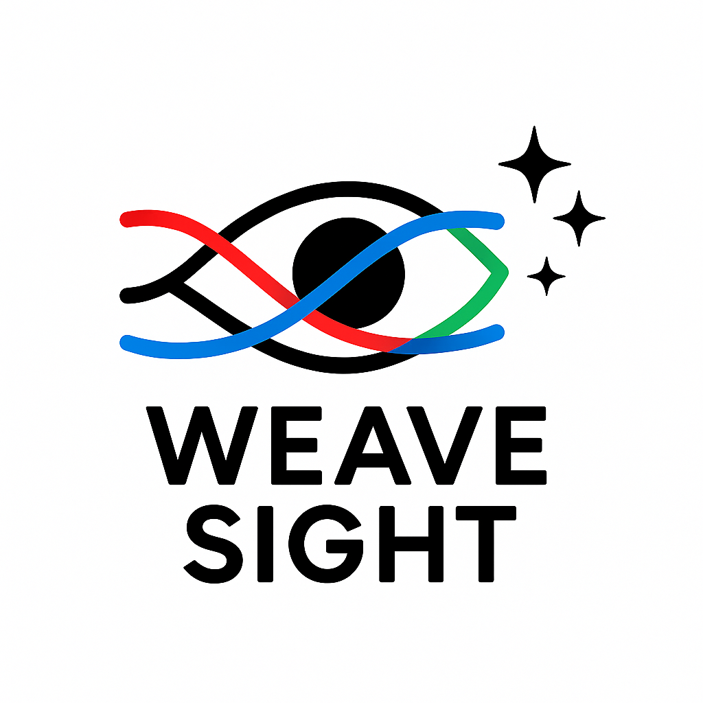

# WeaveSight 🚀

<p align="center">
  
</p>

**WeaveSight is a personal knowledge management tool designed to help you connect the dots between your daily notes, tasks, and long-term goals. It's an experimental Progressive Web App (PWA) built with a focus on privacy, simplicity, and the power of on-device AI.**

This project is being developed as an entry for the Google AI Chrome Contest, exploring the potential of running AI models directly in the browser for a faster and more secure user experience.

---

## 🌟 Key Features

*   **Unified Dashboard:** A central place for your notes, to-do lists, and project trackers.
*   **Intelligent Linking:** WeaveSight automatically suggests connections between related pieces of information, helping you discover patterns in your own data.
*   **On-Device AI:** Powered by modern web AI models, all data processing happens locally in your browser. Nothing is ever sent to a server, ensuring 100% privacy.
*   **Progressive Web App (PWA):** Installable on any device (desktop or mobile) for a native-like experience and offline access.
*   **Minimalist Interface:** A clean, distraction-free UI that helps you focus on what matters: your thoughts and your work.

---

## 💡 The Problem I'm Solving

In a world of information overload, our personal knowledge is often scattered across countless apps and documents. We have notes here, tasks there, and project plans somewhere else. This fragmentation makes it difficult to see the bigger picture and connect ideas.

Tools like Notion or Obsidian are powerful, but they often rely on the cloud or have a steep learning curve. WeaveSight aims to offer a simpler, privacy-first alternative by leveraging the power of AI that runs entirely on your own device.

---

## 🛠️ Tech Stack & Architecture

This project is built using a modern web development stack:

*   **Frontend:** React.js with Vite for a fast development experience.
*   **Styling:** Tailwind CSS for a utility-first and responsive design.
*   **On-Device AI:** Using the [Google AI Edge](https://ai.google.dev/edge) models (e.g., Gemma) via the Web ML APIs.
*   **Local Storage:** IndexedDB for persistent, offline data storage directly in the browser.
*   **PWA Functionality:** Service Workers to manage offline capabilities and caching.

### System Diagram (High-Level)
 
*(Sugestão: Crie um diagrama simples em ferramentas como diagrams.net ou Excalidraw e adicione o link aqui)*

---

## 🚀 Getting Started

*(Esta secção será preenchida quando o projeto estiver mais avançado)*

### Prerequisites
*   Node.js (v18+)
*   A modern web browser with support for Web ML APIs (like Chrome).

### Installation & Running Locally
```bash
# 1. Clone the repository
git clone https://github.com/your_username/weavesight.git
cd weavesight

# 2. Install dependencies
npm install

# 3. Run the development server
npm run dev